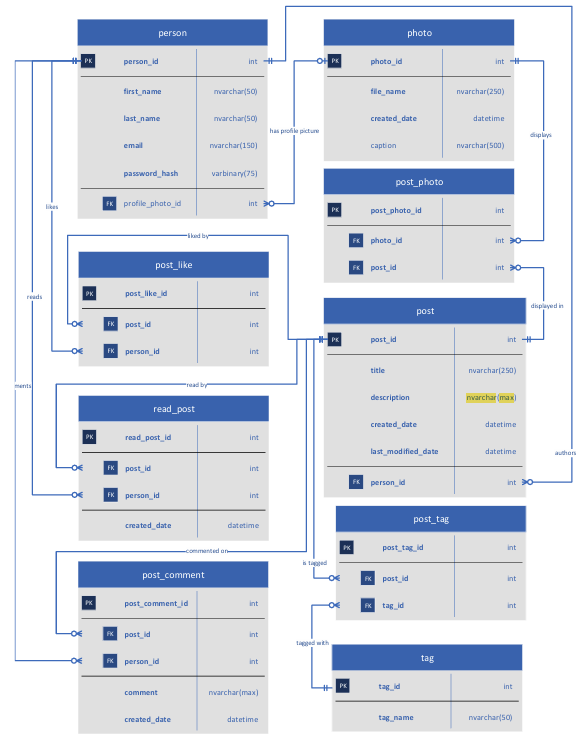

# Blog Website Database

A relational database for a simple blogging platform, implemented in **MySQL**,
with a set of **14 analytical SQL queries** answering real questions about the
data (engagement, tags, authorship, read/like/comment activity).

Originally built for a database design course; cleaned up and documented here as
a portfolio piece.

## Schema

Nine related tables model people, posts, photos, tags and the engagement between
them (reads, likes, comments):

`person` · `post` · `photo` · `post_photo` · `post_like` · `read_post` ·
`post_comment` · `tag` · `post_tag`



Design notes:

- All primary keys use `AUTO_INCREMENT`.
- Foreign keys enforce referential integrity as shown in the ERD.
- `created_date` / `last_modified_date` default to `NOW()` where appropriate.
- Passwords are never stored in plain text — the `password_hash` column holds
  **BCrypt** salted hashes (`varbinary`).

## Running it

1. Create and populate the database from the logical backup (structure + data):

   ```bash
   mysql -u <user> -p < Blog_Backup.sql
   ```

2. Run any of the queries in [`queries/`](queries/) — each file is a single
   `SELECT` and starts with a comment stating the question it answers.

All queries are written to be **generic** (they keep working as rows are added),
not hard-coded to specific IDs.

## The 14 queries

| # | Question |
|---|----------|
| 1 | Posts tagged 'DIY' |
| 2 | All tags for a given post |
| 3 | Which post has the most tags (all posts, incl. zero) |
| 4 | Posts with no tags |
| 5 | Which tag has the most posts (all tags, incl. zero) |
| 6 | Posts that have been read |
| 7 | Posts that have not been read |
| 8 | Posts edited after they were created |
| 9 | Posts with no photos |
| 10 | Most-liked posts (all posts, incl. zero likes) |
| 11 | Author(s) with the most posts and the least posts |
| 12 | Posts with photos, plus their comments (if any) |
| 13 | Every post with its counts of reads, likes and comments |
| 14 | All photos classified as profile photos or post photos |

## Highlights

- **`queries/11.sql`** — finds the authors with the most *and* the fewest posts
  in one statement, using nested subqueries to compare each author's post count
  against the overall `MAX` and `MIN`. Correctly includes authors with zero
  posts via a `RIGHT JOIN`.
- **`queries/13.sql`** — returns one row per post with three independent
  aggregates (reads, likes, comments), each computed with a correlated subquery
  in the column list and `IFNULL` so posts with no activity show `0` instead of
  `NULL`.

## Data

The seed data is fictional. Sample email addresses have been anonymized to the
`@example.com` domain.
